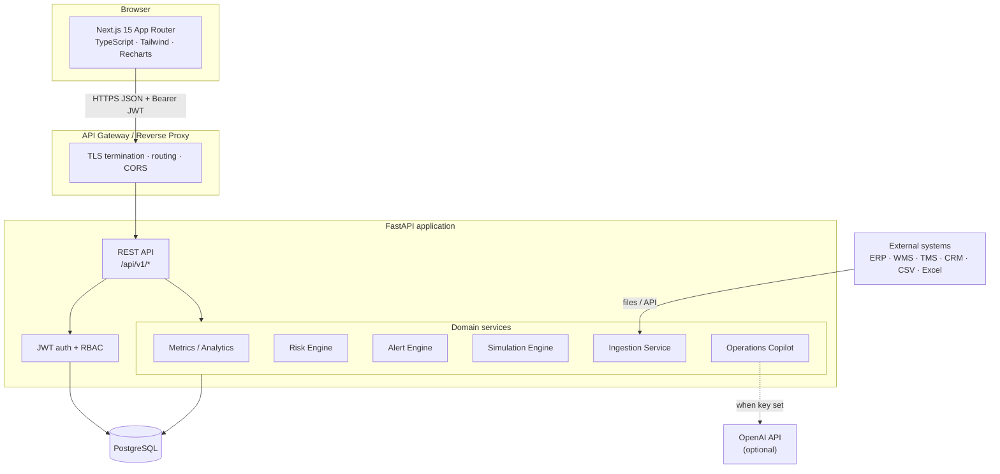
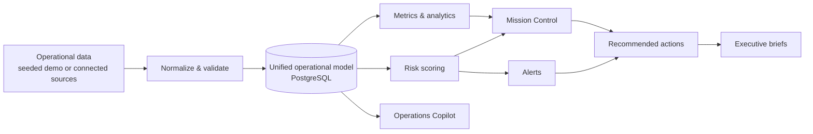
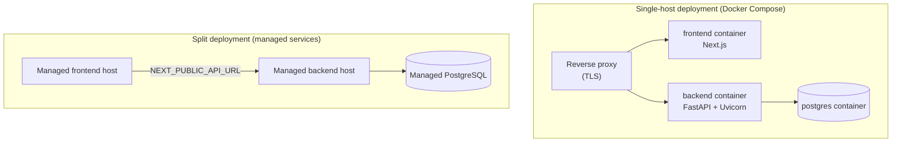
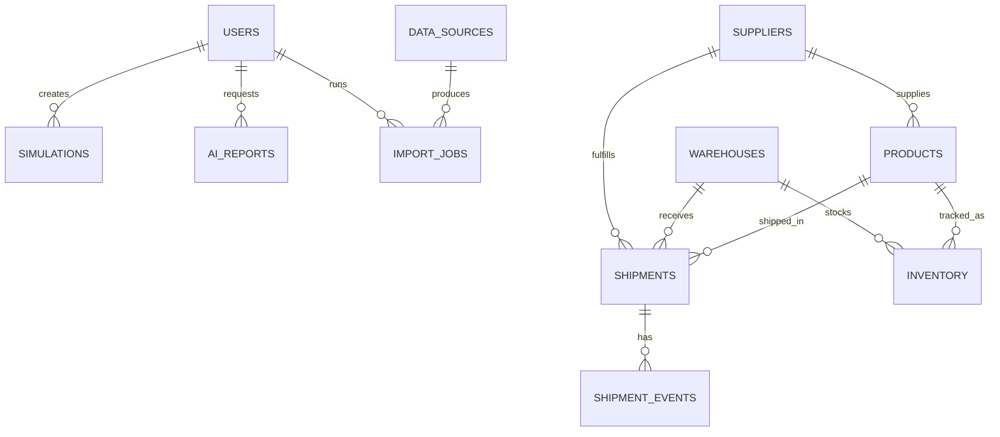
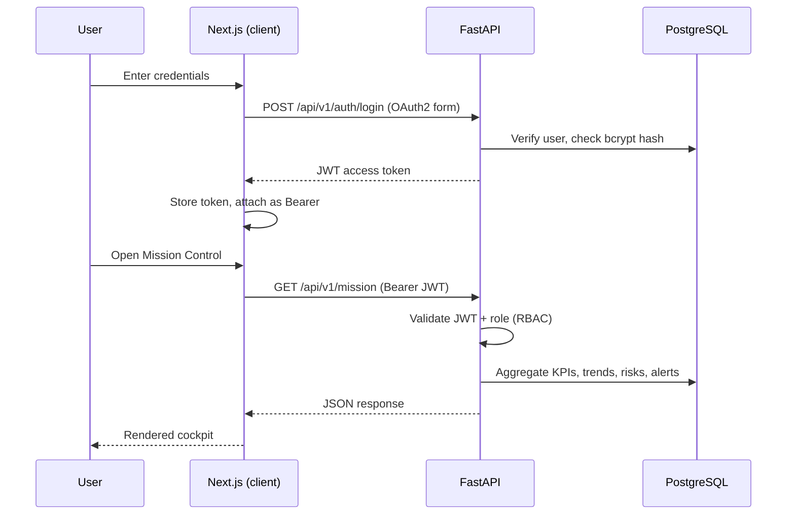
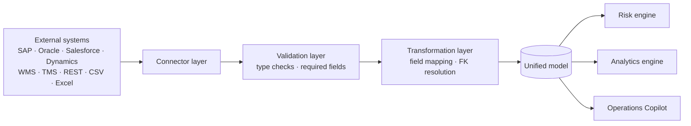

# ATLASOPS — Architecture

This document describes the system architecture of ATLASOPS: its major components, how
data flows through the platform, the deployment model, the data model, the request
lifecycle, and the data integration pipeline.

ATLASOPS is a three-tier application:

- **Frontend** — Next.js 15 (App Router, TypeScript, Tailwind CSS).
- **Backend** — FastAPI exposing a versioned REST API (`/api/v1`), organized into thin
  controllers over a set of domain services.
- **Database** — PostgreSQL, modeled with SQLAlchemy 2.0 and migrated with Alembic.

An optional OpenAI integration powers the Operations Copilot; when no key is configured,
a deterministic local engine produces grounded answers from the same data context.

---

## 1. System architecture



**Design principles**

- **Thin controllers, rich services.** Routers validate input and delegate; all domain
  logic lives in `services/` and is unit-testable without HTTP.
- **Single source of truth for the schema.** ORM models drive both `create_all` (dev) and
  Alembic autogenerate (migrations).
- **Deterministic engines.** Risk, simulation and the local Copilot engine are
  deterministic, so results are explainable and reproducible.
- **Graceful AI degradation.** If OpenAI is unavailable, the Copilot transparently falls
  back to the local engine.
- **Stateless backend.** JWT-based auth avoids server-side sessions, enabling horizontal
  scaling behind a load balancer.

---

## 2. Data flow

How operational data becomes decisions:



---

## 3. Deployment architecture

ATLASOPS is cloud-native and containerized. The default deployment runs the full stack
with Docker Compose; a split deployment (managed frontend + backend host + managed
Postgres) is also supported.



**Notes**

- Place a reverse proxy (Caddy, Nginx, Traefik) in front for TLS termination.
- Set strong values for `JWT_SECRET_KEY` and the database password before any non-local
  deployment.
- Configuration is environment-driven; no secrets are committed to the repository.

---

## 4. Database / ER model

The full entity-relationship diagram, column definitions, constraints and indexes are
documented in [`docs/DATABASE.md`](docs/DATABASE.md). Summary of the core entities:



Core domain tables: `users`, `suppliers`, `warehouses`, `products`, `inventory`,
`shipments`, `shipment_events`, `alerts`, `risk_assessments`, `simulations`,
`ai_reports`, `audit_logs`. Connected Mode adds `data_sources`, `import_jobs` and
`app_settings`.

---

## 5. Request lifecycle



---

## 6. Integration flow

External systems flow through a consistent ingestion pipeline before reaching the unified
model. CSV and Excel ingestion are fully implemented; enterprise connectors are provided
as configurable templates. See [`docs/INTEGRATIONS.md`](docs/INTEGRATIONS.md) for detail.



---

## 7. Backend layering

```
backend/app/
├── core/        config (env), database (engine/session), security (JWT, hashing)
├── models/      SQLAlchemy ORM models + enums — the source of truth for the schema
├── schemas/     Pydantic request/response contracts
├── services/    business logic (no HTTP):
│                  • metrics.py            KPI + trend aggregation
│                  • risk_engine.py        0–100 scoring per category/entity
│                  • alert_engine.py       state → alert generation
│                  • simulation_engine.py  disruption scenarios → impacts
│                  • ingestion.py          connectors, parsing, validation, import
│                  • ai_advisor.py         context builder + OpenAI/local answer
│                  • inventory_logic.py    pure inventory math
├── api/
│   ├── deps.py   get_current_user + require_roles(...) RBAC dependency factory
│   └── routers/  one router per module, thin controllers over services
├── seed/        synthetic data engine
├── cli.py       operational commands (init-db, seed, reset, create-user)
└── main.py      app assembly + CORS + router mounting
```

---

## 8. Frontend architecture

- **Route groups.** A public marketing site (`app/(marketing)`), authenticated
  application (`app/(app)`), and a standalone `/login` route.
- **Auth context** (`lib/auth.tsx`) holds the user, hydrates from `/auth/me`, and
  redirects unauthenticated users.
- **Typed API client** (`lib/api.ts`) attaches the Bearer token, centralizes error
  handling, supports multipart uploads, and auto-redirects on 401.
- **`useFetch` hook** for declarative data loading with loading/error states.
- **Composable UI**: primitives in `components/ui`, chart wrappers in `components/charts`,
  marketing components in `components/marketing`, and shared widgets in `components/shared`.
- **Theming** via `next-themes` with CSS variables (light default; dark mode available in
  the application).

---

## 9. Scaling considerations

- The backend is stateless and horizontally scalable behind a load balancer.
- Database connection pooling is configured in `core/database.py`.
- Heavy aggregation endpoints (mission control, analytics) are read-only and
  cache-friendly; a read replica and an HTTP caching layer are natural next steps.
- The risk and alert engines are designed to run on a schedule (worker/cron) in
  production rather than on demand.
