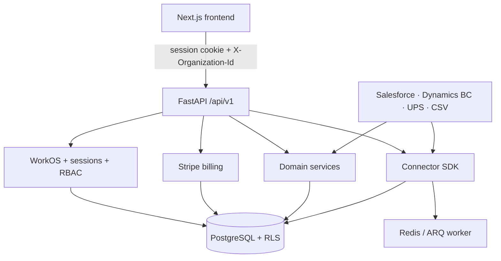

# ATLASOPS / Supply v2 — Architecture

**Master vision & roadmap:** [docs/MASTER_PLATFORM.md](docs/MASTER_PLATFORM.md) — build differentiators; integrate WorkOS, Stripe, Resend, Sentry, PostHog, S3/R2, Flagsmith.

Supply v2 is a **multi-tenant** operational intelligence platform:

- **Frontend** — Next.js 15 (App Router, TypeScript, Tailwind).
- **Backend** — FastAPI (`/api/v1`), domain services, Connector SDK, Stripe billing.
- **Database** — PostgreSQL 16, SQLAlchemy 2.0, Alembic; tenant FORCE RLS.
- **Workers** — Redis + ARQ for connector sync jobs.
- **Identity** — Email-first WorkOS SSO (organization discovery + AuthKit); httpOnly `supply_session` cookies (not JWT in localStorage). See [docs/AUTHENTICATION.md](docs/AUTHENTICATION.md).

---

## 1. System architecture

```mermaid
flowchart TB
    UI["Next.js frontend"] -->|session cookie + X-Organization-Id| API["FastAPI /api/v1"]
    API --> AUTH["WorkOS + sessions + RBAC"]
    API --> BILL["Stripe billing"]
    API --> CONN["Connector SDK"]
    API --> SVC["Domain services"]
    CONN --> REDIS["Redis / ARQ worker"]
    AUTH --> DB[("PostgreSQL + RLS")]
    BILL --> DB
    SVC --> DB
    CONN --> DB
    EXT["Salesforce · Dynamics BC · UPS · CSV"] --> CONN
    EXT --> SVC
```

**Design principles**

- Thin routers, rich services; tenant context from `ensure_request_context`.
- Shared schema + `organization_id` + FORCE RLS (`app.current_org_id`).
- Fail closed in `ENVIRONMENT=production` without required secrets.
- Real connectors only — no simulated ERP sync in the request path.

---

## 2. Multi-tenancy & auth

| Concern | Implementation |
| --- | --- |
| Identity | WorkOS user → `users` row |
| Tenancy | `organizations`, `memberships`, role slug → permission set |
| Session | Server-side `sessions` table; cookie `supply_session` |
| API access | Org-bound `api_tokens` (`sup_…`); header cannot switch org |
| Authorization | `require_permission("…")` on routes |
| Isolation | App filters + PostgreSQL RLS |

Login UX: work email → `POST /auth/continue` → WorkOS IdP (PKCE + state) → `/auth/callback`.
Dev-only: `POST /auth/dev-login` when `ENVIRONMENT=development` and WorkOS is unset (never in staging/production).

---

## 3. Billing

Stripe Checkout / Customer Portal; webhooks verified with `STRIPE_WEBHOOK_SECRET`.
Handlers set tenant RLS context and record `stripe_events.stripe_event_id` for
idempotency before applying side effects.

---

## 4. Connectors

`backend/app/connectors/` — base SDK, registry, encrypted credentials, SSRF allowlist,
implementations:

- Dynamics 365 Business Central
- Salesforce
- UPS

`POST /data/sources/{id}/sync` enqueues ARQ job `sync_connection`. Worker:
`arq app.worker.WorkerSettings`. Credentials never returned in plaintext.

---

## 5. Request lifecycle

1. CORS / security headers / request id middleware  
2. Session cookie or Bearer API token  
3. Resolve org (`X-Organization-Id` or session/token org)  
4. Membership + permissions; `set_session_org` on Postgres  
5. Router → service → commit + optional audit  

---

## 6. Deployment

Docker Compose: `db`, `redis`, `backend`, `worker`, `frontend`.  
See `docs/DEPLOYMENT.md`, `docs/MIGRATION_V2.md`, `render.yaml`.

OpenAI is optional for the Operations Copilot; a local engine runs without a key.
