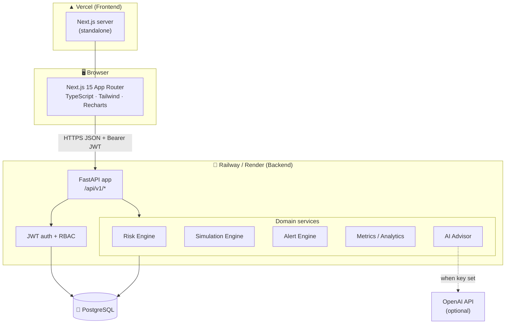

# System Architecture

SupplyChain Command Center is a three-tier application: a Next.js frontend, a FastAPI backend exposing a versioned REST API, and a PostgreSQL database. An optional OpenAI integration powers the AI advisor, with a deterministic local engine as a fallback.

## High-level diagram



## Request lifecycle

```mermaid
sequenceDiagram
    participant U as User
    participant F as Next.js (client)
    participant A as FastAPI
    participant D as PostgreSQL

    U->>F: Enter credentials
    F->>A: POST /api/v1/auth/login (form)
    A->>D: Verify user, check bcrypt hash
    A-->>F: JWT access token
    F->>F: Store token (localStorage)
    U->>F: Open Dashboard
    F->>A: GET /api/v1/dashboard (Bearer JWT)
    A->>A: Validate JWT + role (RBAC)
    A->>D: Aggregate KPIs, trends, risks, alerts
    A-->>F: DashboardResponse JSON
    F-->>U: Rendered KPIs + charts
```



## Backend layering

```
app/
├── core/        config (env), database (engine/session), security (JWT, hashing)
├── models/      SQLAlchemy ORM models + enums  ── the source of truth for the schema
├── schemas/     Pydantic request/response contracts
├── services/    business logic (no HTTP):
│                  • metrics.py            KPI + trend aggregation
│                  • risk_engine.py        0–100 scoring per category/entity
│                  • alert_engine.py       state → alerts generation
│                  • simulation_engine.py  disruption scenarios → impacts
│                  • ai_advisor.py         context builder + OpenAI/local answer
│                  • inventory_logic.py    pure inventory math
├── api/
│   ├── deps.py   get_current_user + require_roles(...) RBAC dependency factory
│   └── routers/  one router per module, thin controllers over services
├── seed/        synthetic data engine
├── cli.py       operational commands (init-db, seed, reset, create-user)
└── main.py      app assembly + CORS + router mounting
```

**Design principles**

- **Thin controllers, rich services.** Routers validate input and delegate; all domain logic lives in `services/` and is unit-testable without HTTP.
- **Single source of truth for the schema.** ORM models drive both `create_all` (dev) and Alembic autogenerate (migrations).
- **Deterministic engines.** Risk, simulation and the local AI engine are deterministic so results are explainable and reproducible.
- **Graceful AI degradation.** If OpenAI is unavailable, the advisor transparently falls back to the local engine.

## Frontend architecture

- **App Router** with a public `/login` route and an authenticated `(app)` route group guarded by an auth layout.
- **Auth context** (`lib/auth.tsx`) holds the user, hydrates from `/auth/me`, and redirects unauthenticated users.
- **Typed API client** (`lib/api.ts`) attaches the Bearer token, centralizes error handling, and auto-redirects on 401.
- **`useFetch` hook** for declarative data loading with loading/error states.
- **Composable UI**: shadcn-style primitives in `components/ui`, chart wrappers in `components/charts`, and shared widgets in `components/shared`.
- **Theming** via `next-themes` with CSS variables (dark default + light mode).

## Scaling notes

- Backend is stateless → horizontally scalable behind a load balancer; JWTs avoid server-side sessions.
- DB connection pooling configured in `core/database.py`.
- Heavy aggregation endpoints (dashboard/analytics) are read-only and cache-friendly; a read replica + HTTP caching layer is a natural next step.
- The risk/alert engines are designed to run on a schedule (cron/worker) in production rather than on demand.
