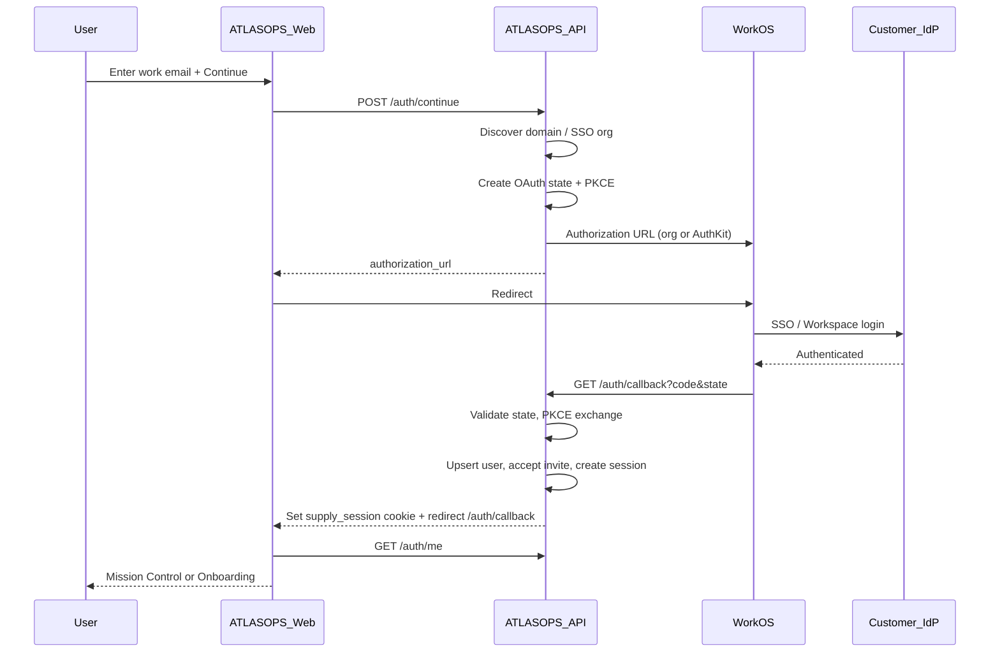

# Authentication Architecture (ATLASOPS)

Enterprise, organization-first authentication for a multi-tenant SaaS platform.
Identity federation is brokered by WorkOS; browser sessions are **opaque httpOnly cookies** managed by ATLASOPS (not JWTs).

## Goals

- Feel like Slack Enterprise / Atlassian / Notion / GitHub Enterprise
- User enters a **work email** and clicks **Continue** — never picks Google/Microsoft/GitHub/WorkOS
- Automatic IdP routing (Okta, Entra ID, Google Workspace, OneLogin, Ping, Auth0, SAML/OIDC)
- Invitation deep links join the correct organization after auth
- Enterprise session administration for users and admins

## High-level flow



## Email-first discovery

1. Parse domain from `john@company.com` → `company.com`
2. Match local org `settings.allowed_email_domains` when configured
3. Look up WorkOS organizations by domain (`list_organizations(domains=[…])`)
4. If a WorkOS organization exists → authorize with `organization_id` (enterprise SSO)
5. Otherwise → AuthKit with `login_hint` + `domain_hint` (Google Workspace / password / other methods WorkOS brokers)

The UI never exposes provider names.

## OAuth security

| Control | Implementation |
| --- | --- |
| CSRF | One-time `state` stored in `oauth_login_states`, consumed on callback |
| PKCE | S256 `code_challenge` on authorize; `code_verifier` on token exchange |
| Open redirects | `return_path` allowlisted to relative same-origin paths |
| Rate limits | `AUTH_RATE_LIMIT_PER_MINUTE` on continue/login/callback/dev-login |
| Cookies | `HttpOnly`, `SameSite=Lax`, `Secure` in staging/production |

## Sessions (cookies, not JWT)

Cookie name: `supply_session` (configurable).

| Setting | Default | Purpose |
| --- | --- | --- |
| `SESSION_TTL_HOURS` | 12 | Absolute TTL without “remember device” |
| `SESSION_REMEMBER_TTL_HOURS` | 720 | Absolute TTL when remember device |
| `SESSION_IDLE_MINUTES` | 60 | Idle revoke (2× for remembered devices) |
| `SESSION_SLIDING_ENABLED` | true | Extend expiry on activity |
| `MAX_CONCURRENT_SESSIONS` | 10 | Oldest session revoked when exceeded |

Session metadata: device label, user-agent, IP, last seen, trusted/remembered flag.

### Session APIs

- `GET /auth/sessions` — current user’s sessions
- `DELETE /auth/sessions/{id}` — revoke one
- `POST /auth/logout` — revoke current
- `POST /auth/logout-all` — revoke all for user

### Admin security APIs

- `GET/PATCH /orgs/current/security/settings` — allowed email domains, SSO link status
- `GET /orgs/current/security/sessions` — org-wide active sessions (`org.members.manage`)
- `DELETE /orgs/current/security/sessions/{id}` — admin revoke
- `GET /orgs/current/security/login-history` — auth audit trail (`org.audit.read`)

UI: **Settings → Security** (`/settings/security`).

## Invitations

1. Admin invites teammate → API returns one-time `invite_url` (`/invite/{token}`)
2. Invitee opens link → preview → Continue to sign-in with email + invite token in OAuth state
3. After callback, invitation is accepted automatically and membership is active
4. No manual organization picker

## Development login

Enabled only when **all** are true:

- `ENVIRONMENT=development`
- WorkOS **not** configured
- Frontend `NODE_ENV=development` **and** `NEXT_PUBLIC_DEV_LOGIN=true`

Hidden completely otherwise (UI + `POST /auth/dev-login` → 404).

## Environment variables

| Variable | Staging/Prod | Notes |
| --- | --- | --- |
| `WORKOS_API_KEY` | required | |
| `WORKOS_CLIENT_ID` | required | |
| `WORKOS_REDIRECT_URI` | API callback URL | e.g. `https://api.example.com/api/v1/auth/callback` |
| `WORKOS_COOKIE_PASSWORD` | required, ≥32 chars | WorkOS sealed session helper |
| `FRONTEND_URL` | required | Post-login redirect base |
| `SESSION_COOKIE_SECURE` | `true` | |
| `SESSION_SECRET` | required, ≥32 | |
| `NEXT_PUBLIC_DEV_LOGIN` | `false` | Must be false in staging/prod builds |

## Government / future IdPs

Do not hardcode providers in the app. Configure SAML/OIDC/Azure Government connections in WorkOS; ATLASOPS continues to call WorkOS with `organization_id` only. Architecture is ready for:

- Azure Government
- SAML / OIDC
- Active Directory / LDAP (via WorkOS Directory Sync / SSO)

## Audit events

Auth-related `AuditLog` actions (resource=`auth`):

`login`, `logout`, `logout_all`, `dev_login`, `revoke_session`, `admin_revoke_session`, `switch_org`, `accept_invitation`, `update_auth_settings`

## Local developer setup

```bash
# API without WorkOS → Dev sign-in panel on /login
cd backend && DATABASE_URL=sqlite:///./dev.db ENVIRONMENT=development \
  .venv/bin/uvicorn app.main:app --reload --port 8000

# Frontend
cd frontend && NEXT_PUBLIC_API_URL=http://127.0.0.1:8000 NEXT_PUBLIC_DEV_LOGIN=true \
  npm run dev
```

With WorkOS configured locally, use the email-first **Continue** button; Dev sign-in is hidden.
