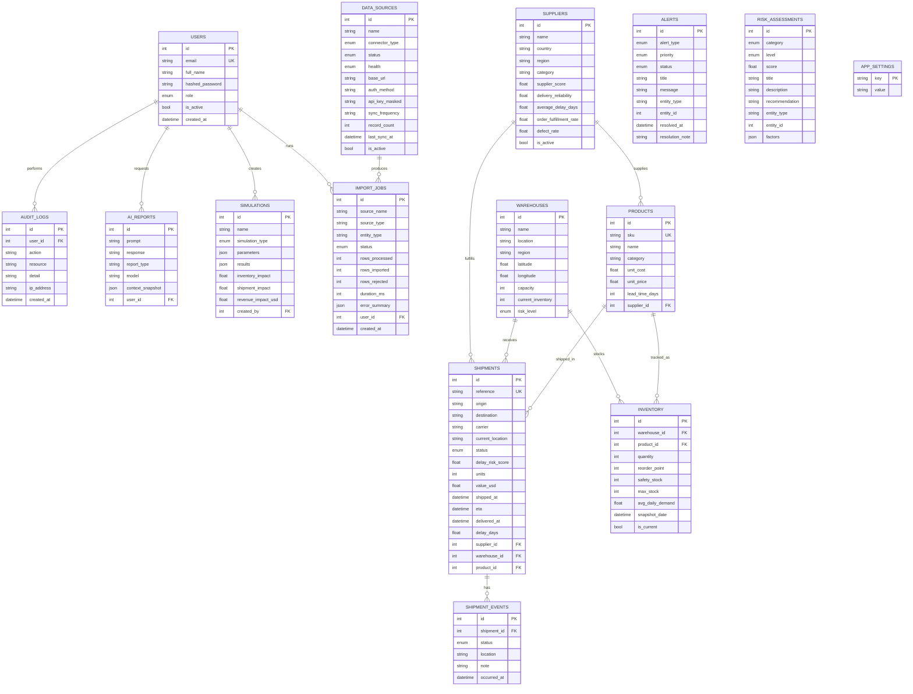

# Database Schema

PostgreSQL 16, modeled with SQLAlchemy 2.0. Migrations are managed with Alembic (`backend/alembic`), and `app.cli init-db` can create the schema directly from the ORM metadata for local development.

## Entity-Relationship Diagram



## Tables

| Table | Purpose |
| --- | --- |
| `users` | Authentication & RBAC (admin / operations_manager / analyst / executive) |
| `suppliers` | Supplier master + performance metrics |
| `warehouses` | Distribution centers with capacity & geo coordinates |
| `products` | Product catalog (SKU, cost/price, lead time) |
| `inventory` | Per-warehouse/product stock; `is_current=true` is live state, historical snapshots are `false` |
| `shipments` | Shipments with status, ETA, delay risk and value |
| `shipment_events` | Tracking timeline per shipment |
| `alerts` | Generated operational alerts with lifecycle (open → acknowledged → resolved) |
| `risk_assessments` | Risk-engine output (0–100 score, level, recommendation, factors) |
| `simulations` | Saved scenario simulations and their computed impacts |
| `ai_reports` | Operations Copilot conversations + the data context used |
| `audit_logs` | Audit trail of sensitive actions |
| `data_sources` | Connected Mode connectors: type, status, health, sync metadata |
| `import_jobs` | History of CSV/Excel/connector ingestion runs and outcomes |
| `app_settings` | Key/value application settings (e.g. operating mode) |

## Constraints & indexes (highlights)

- **Check constraints:** score columns bounded `0–100` (`supplier_score`, `delay_risk_score`, risk `score`); `capacity > 0`; `quantity >= 0`.
- **Unique:** `users.email`, `products.sku`, `shipments.reference`.
- **Foreign keys** with sensible `ON DELETE` behavior (`CASCADE` for inventory/events, `SET NULL` for soft references).
- **Indexes:** shipment `status`/`eta`/`supplier`, inventory `(warehouse_id, product_id)` and `is_current`, alerts `(status, priority)`, risk `(category, level)`, audit `(user_id, created_at)`.

## Migrations

```bash
cd backend
# autogenerate a new migration after model changes
alembic revision --autogenerate -m "describe change"
# apply migrations
alembic upgrade head
```

> For convenience in local/dev and the Docker entrypoint, `python -m app.cli init-db` creates the schema directly from ORM metadata. Use Alembic for controlled, versioned changes in production.
