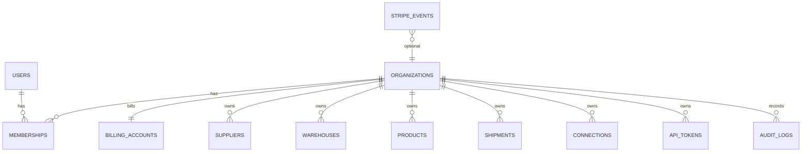

# Database Schema (Supply v2)

PostgreSQL 16, SQLAlchemy 2.0, Alembic (`backend/alembic`).

- Primary keys are **UUID**.
- Tenant-owned tables include `organization_id` and are covered by **FORCE RLS**.
- Identity tables (`users`, `organizations`, `memberships`, `sessions`, `invitations`)
  are not RLS-scoped the same way — cross-tenant identity flows use explicit filters.

## Core ER (simplified)

```mermaid
erDiagram
    USERS ||--o{ MEMBERSHIPS : has
    ORGANIZATIONS ||--o{ MEMBERSHIPS : has
    ORGANIZATIONS ||--|| BILLING_ACCOUNTS : bills
    ORGANIZATIONS ||--o{ SUPPLIERS : owns
    ORGANIZATIONS ||--o{ WAREHOUSES : owns
    ORGANIZATIONS ||--o{ PRODUCTS : owns
    ORGANIZATIONS ||--o{ SHIPMENTS : owns
    ORGANIZATIONS ||--o{ CONNECTIONS : owns
    ORGANIZATIONS ||--o{ API_TOKENS : owns
    ORGANIZATIONS ||--o{ AUDIT_LOGS : records
    STRIPE_EVENTS }o--|| ORGANIZATIONS : optional
```

## Migrations

| Revision | Purpose |
| --- | --- |
| `77ea022a336b` | Legacy initial schema |
| `0002_supply_v2_multitenant` | Multi-tenant rebuild |
| `0003_shipment_fk_indexes` | Shipment FK indexes + inventory uniqueness |
| `0004_stripe_events_idempotency` | `stripe_events` webhook idempotency |

Apply: `alembic upgrade head`. Production must not rely on `create_all`.

## RLS

Policies bind rows to `current_setting('app.current_org_id')`. The API sets the GUC via
`set_session_org`. Stripe webhooks resolve org then set the GUC; customer-id lookup may
briefly disable row security for signature-verified system resolution only.

Use a **non-superuser** app role in production so FORCE RLS is effective.

## Notable system tables

| Table | Notes |
| --- | --- |
| `stripe_events` | Global unique `stripe_event_id`; not tenant-RLS |
| `billing_accounts` | 1:1 org; Stripe customer/subscription ids |
| `connections` | Connector config + encrypted credentials |
| `import_jobs` | CSV/Excel import history |
| `audit_logs` | Append-only with integrity hash chain |

SQLite is supported for local unit tests only — RLS is Postgres-specific.
