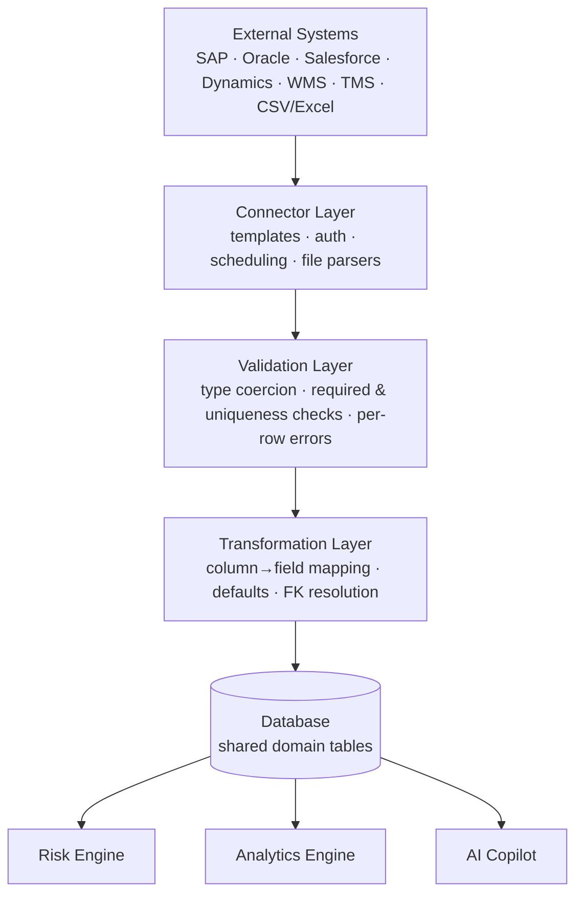

# Enterprise Integrations & Data Ingestion

This document describes how **Connected Mode** works: the ingestion architecture,
the connector framework, the CSV/Excel import pipeline, and the supporting API.

Connected Mode is **additive**. Demo Mode and the seeded dataset are always
present — integrations are an opt-in layer on top.

---

## 1. Operating modes

| Mode | Source of truth | Setup | UI indicator |
| --- | --- | --- | --- |
| **Demo** (default) | Seeded synthetic dataset | None | `Demo Dataset Active` badge |
| **Connected** | External systems + file imports | Configure a connector or import a file | `Connected Mode` badge |

The active mode is stored in the `app_settings` table (`operating_mode` key) and
served by `GET /api/v1/data/mode`. Switching modes never deletes data.

---

## 2. Ingestion architecture

| Layer | Implementation |
| --- | --- |
| **Connector Layer** | `services/ingestion.py` — integration template catalog, connector CRUD, sync simulation, and CSV/XLSX parsers (`parse_upload`). |
| **Validation Layer** | `validate_rows` / `_transform_row` — coerces each cell to the target type, enforces required fields, and emits structured per-row errors. |
| **Transformation Layer** | `suggest_mapping` (auto header→field matching) + `_build_entity` (defaults, enum coercion, and foreign-key resolution for inventory). |
| **Database** | The **same** domain tables used by the rest of the app (`suppliers`, `warehouses`, `products`, `shipments`, `inventory`), so imported rows are first-class. |
| **Risk / Analytics / Copilot** | Read from the database — no special-casing. Newly ingested data automatically flows into risk scoring, analytics and Copilot answers. |

Every run — a file import **or** a connector sync — is persisted as an
`import_jobs` row (the unified *pipeline job*) with `rows_processed`,
`rows_imported`, `rows_rejected`, `duration_ms`, `status` and an `error_summary`.

---

## 3. Data model additions

| Table | Purpose |
| --- | --- |
| `data_sources` | A configured connector: type, status, health, base URL, masked API key, auth method, sync frequency, webhook URL, record count, last sync. |
| `import_jobs` | A pipeline run (CSV/Excel import or connector sync) with row counts, duration, status and captured errors. |
| `app_settings` | Key/value store; holds `operating_mode`. |

New enums: `ConnectorType`, `ConnectorStatus`, `ConnectorHealth`, `ImportStatus`, `OperatingMode`.

These tables are created additively on startup (`Base.metadata.create_all`) and a
small set of **mock connectors + pipeline history** is seeded once (idempotent) so
the surfaces are populated for demos.

---

## 4. Importable entities

Each entity has a field spec (name · label · required · type · default) driving the
mapping UI and validation. Supported targets: **suppliers**, **warehouses**,
**products**, **shipments**, **inventory**.

- Headers are auto-mapped (normalized, case/space-insensitive); users can override.
- Inventory rows resolve foreign keys by **warehouse name** and **product SKU**;
  unresolved rows are rejected with a clear reason.
- Shipments receive sensible defaults (`status=in_transit`, `shipped_at=now`,
  `eta=now+14d`, `current_location=origin`).

---

## 5. API reference (`/api/v1/data`)

| Method & path | Auth | Description |
| --- | --- | --- |
| `GET /data/mode` | any | Current operating mode. |
| `PUT /data/mode` | ops/analyst/admin | Set operating mode (`demo`/`connected`). |
| `GET /data/summary` | any | Dashboard rollup (connected systems, available integrations, last sync, records imported, status counts, failures). |
| `GET /data/integrations` | any | Integration template catalog (with `configured` flag). |
| `GET /data/entities` | any | Field specs for importable entities. |
| `GET /data/sources` | any | List configured connectors. |
| `GET /data/sources/{id}` | any | Connector detail. |
| `POST /data/sources` | ops/analyst/admin | Add a connector from a template. |
| `PUT /data/sources/{id}/config` | ops/analyst/admin | Update base URL / auth / frequency / webhook / API key (stored masked). |
| `POST /data/sources/{id}/test` | ops/analyst/admin | Simulated connection test. |
| `POST /data/sources/{id}/sync` | ops/analyst/admin | Trigger a (simulated) sync; logs a pipeline job. |
| `DELETE /data/sources/{id}` | ops/analyst/admin | Remove a connector. |
| `POST /data/import/preview` | any | Multipart upload → columns, sheets, suggested mapping, validation, preview rows (no writes). |
| `POST /data/import/commit` | ops/analyst/admin | Multipart upload + mapping → inserts rows, returns imported/rejected, logs a pipeline job. |
| `GET /data/imports` | any | CSV/Excel import history. |
| `GET /data/pipeline` | any | All pipeline runs (imports + connector syncs) for the monitor. |

Import endpoints are `multipart/form-data`: `file`, `entity`, optional `sheet`
(Excel), and `mapping` (JSON string of `field → column`).

---

## 6. AI Copilot integration

`ai_advisor.build_context` includes a compact `data_sources` snapshot (mode,
connected systems, per-source status/health/last-sync, records imported today, and
failures). The local engine recognizes ingestion intents and answers questions
like *"When was SAP last synced?"* or *"Which systems have ingestion failures?"*.
